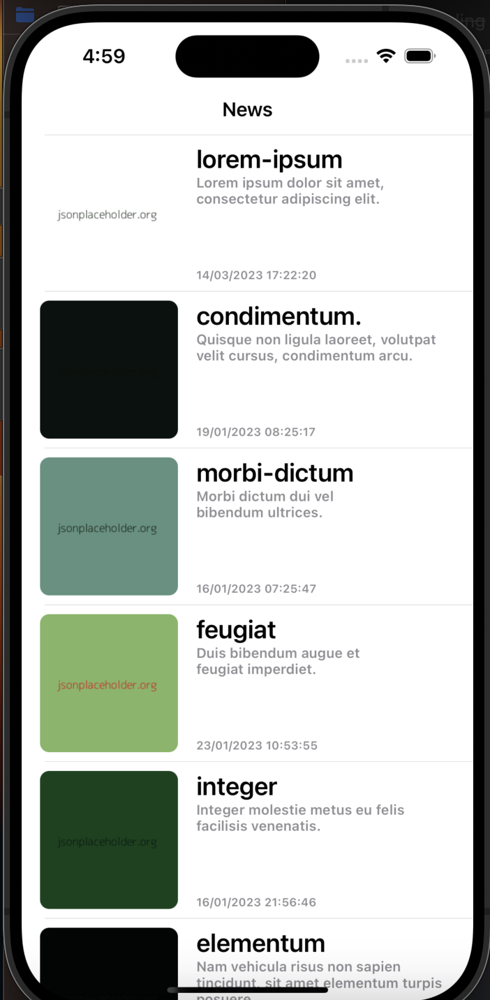
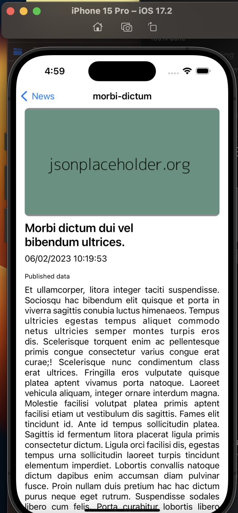

# News App

A simple iOS news application built with UIKit that displays news articles from JSONPlaceholder API. This project was created as a take-home test for JustLogin.

## Features

- List of news articles with thumbnails
- Detailed view of each article

## Screenshots

### News List Screen

### News Detail Screen

## Requirements

- iOS 17.2+
- Xcode 15.0+
- Swift 5.0+

## Dependencies

This project uses the following dependencies:

- [Kingfisher](https://github.com/onevcat/Kingfisher) - For efficient image downloading and caching
- [SnapKit](https://github.com/SnapKit/SnapKit) - For programmatic Auto Layout constraints

## Installation

1. Clone the repository:
2. Open the `.xcodeproj` file:
3. Wait for Xcode to automatically resolve SPM dependencies
   - If dependencies aren't resolved automatically:
     - File → Add Packages
     - Add the following package URLs:
       - Kingfisher: `https://github.com/onevcat/Kingfisher.git`
       - SnapKit: `https://github.com/SnapKit/SnapKit.git`

# Architecture

The project follows a clean architecture pattern with:

- MVVM (Model-View-ViewModel) design pattern
- Programmatic UI using UIKit
- Network layer for API communication

## Testing

The project includes comprehensive unit tests covering:

- ViewModels

To run the tests:

1. Open the project in Xcode
2. Press `⌘ + U` or navigate to Product → Test
3. View test results in the Test Navigator

Test coverage includes:

- ViewModel business logic

## API

The app fetches news data from:

- Endpoint: [https://jsonplaceholder.org/posts](https://jsonplaceholder.org/posts)

## Screens

1. News List Screen

   - Displays a list of news articles
   - Shows thumbnail, title, and brief content
   - Implements UITableView for efficient scrolling

2. News Detail Screen
   - Shows full article content
   - Displays high-resolution image
   - Presents additional article metadata

## Contributing

This is a test project, but if you'd like to contribute:

1. Fork the project
2. Create your feature branch (`git checkout -b feature/AmazingFeature`)
3. Commit your changes (`git commit -m 'Add some AmazingFeature'`)
4. Push to the branch (`git push origin feature/AmazingFeature`)
5. Open a Pull Request

## License

This project is licensed under the MIT License - see the [LICENSE.md](LICENSE.md) file for details

## Acknowledgments

- [JSONPlaceholder](https://jsonplaceholder.org/) for providing the API
- JustLogin for the opportunity

## Contact

Your Name - hd.wijoyo@gmail.com

Project Link: [https://github.com/yourusername/news-app](https://github.com/sukmahd/news-app-just-login)
